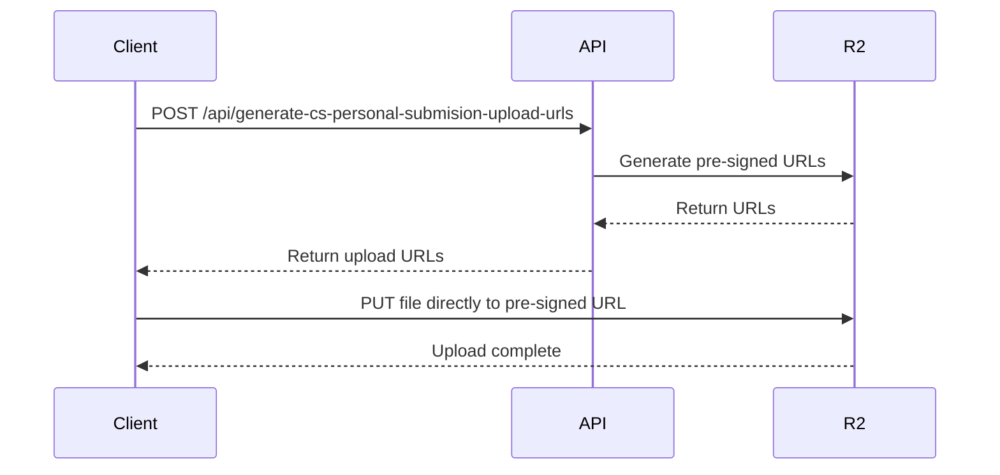

## Overview

The File Upload API provides secure file upload capabilities using pre-signed URLs for Cloudflare R2 (S3-compatible storage). This approach ensures:

- **Direct uploads** to R2 without proxying through your server
- **Time-limited URLs** that expire after 10 minutes
- **Unique file paths** based on submission IDs
- **Content-Type validation** for proper file handling

## Architecture

File uploads use a two-step process:

1. **Request pre-signed URLs** from the API
2. **Upload files directly** to R2 using the pre-signed URLs



## Generate Upload URLs (Community Seva)

Generate pre-signed upload URLs for community seva personal submissions.

### Endpoint

```
POST /api/generate-cs-personal-submision-upload-urls
```

### Request Body

<ParamField body="submissionId" type="string" required>
  Unique identifier for the submission
</ParamField>

<ParamField body="activityName" type="string" required>
  Name of the activity (used in file path)
</ParamField>

<ParamField body="files" type="array" required>
  Array of file metadata objects
</ParamField>

<ParamField body="files[].name" type="string" required>
  Original filename
</ParamField>

<ParamField body="files[].type" type="string" required>
  MIME type (e.g., "image/jpeg", "video/mp4")
</ParamField>

<ParamField body="folderName" type="string" required>
  Top-level folder name in R2 bucket
</ParamField>

### Response

<ResponseField name="uploadUrls" type="array">
  Array of upload URL objects
</ResponseField>

<ResponseField name="uploadUrls[].url" type="string">
  Pre-signed URL for PUT request (expires in 600 seconds)
</ResponseField>

<ResponseField name="uploadUrls[].key" type="string">
  S3 object key (full path in bucket)
</ResponseField>

<ResponseField name="uploadUrls[].filename" type="string">
  Original filename for reference
</ResponseField>

### Implementation

<CodeGroup>

```typescript app/api/generate-cs-personal-submision-upload-urls/route.ts
import { S3Client, PutObjectCommand } from "@aws-sdk/client-s3"
import { getSignedUrl } from "@aws-sdk/s3-request-presigner"

const s3Client = new S3Client({
  region: "auto",
  endpoint: process.env.R2_ENDPOINT as string,
  credentials: {
    accessKeyId: process.env.R2_ACCESS_KEY_ID as string,
    secretAccessKey: process.env.R2_SECRET_ACCESS_KEY as string,
  },
})

export async function POST(request: NextRequest) {
  const body = await request.json()
  const { submissionId, activityName, files, folderName } = body

  if (!submissionId || !activityName || !files || !Array.isArray(files) || !folderName) {
    return Response.json(
      { error: 'Missing submissionId, activityName, files, or folderName' },
      { status: 400 }
    )
  }

  const uploadUrls = []

  for (const file of files) {
    const cleanActivityName = activityName.trim().replace(/\s+/g, '_')
    const bucketPrefix = `${folderName}/`
    const key = `${bucketPrefix}${submissionId}_${cleanActivityName}/${file.name}`

    const command = new PutObjectCommand({
      Bucket: process.env.R2_BUCKET_NAME as string,
      Key: key,
      ContentType: file.type,
    })

    const url = await getSignedUrl(s3Client, command, { expiresIn: 600 })

    uploadUrls.push({ url, key, filename: file.name })
  }

  return Response.json({ uploadUrls })
}
```

```bash Example Request
curl -X POST 'https://njrajatmahotsav.com/api/generate-cs-personal-submision-upload-urls' \
  -H 'Content-Type: application/json' \
  -d '{
    "submissionId": "cs-12345",
    "activityName": "Cleanliness Drive",
    "folderName": "community-seva",
    "files": [
      {
        "name": "photo1.jpg",
        "type": "image/jpeg"
      },
      {
        "name": "video1.mp4",
        "type": "video/mp4"
      }
    ]
  }'
```

```json Example Response
{
  "uploadUrls": [
    {
      "url": "https://r2.cloudflarestorage.com/bucket/community-seva/cs-12345_Cleanliness_Drive/photo1.jpg?X-Amz-Algorithm=...",
      "key": "community-seva/cs-12345_Cleanliness_Drive/photo1.jpg",
      "filename": "photo1.jpg"
    },
    {
      "url": "https://r2.cloudflarestorage.com/bucket/community-seva/cs-12345_Cleanliness_Drive/video1.mp4?X-Amz-Algorithm=...",
      "key": "community-seva/cs-12345_Cleanliness_Drive/video1.mp4",
      "filename": "video1.mp4"
    }
  ]
}
```

</CodeGroup>

### File Path Structure

```
{folderName}/
└── {submissionId}_{cleanActivityName}/
    ├── file1.jpg
    ├── file2.png
    └── video1.mp4
```

**Activity Name Processing:**
- Whitespace is trimmed
- Spaces are replaced with underscores
- Original casing is preserved

Example: `"Cleanliness Drive"` → `"Cleanliness_Drive"`

## Generate Upload URLs (Legacy)

Legacy endpoint for event submissions using a different directory structure.

### Endpoint

```
POST /api/generate-upload-ursl
```

<Note>
This is a legacy endpoint with a typo in the filename ("ursl" instead of "urls"). New integrations should use the community seva endpoint.
</Note>

### Request Body

<ParamField body="submissionId" type="string" required>
  Unique identifier for the submission
</ParamField>

<ParamField body="eventName" type="string" required>
  Name of the event (used in file path)
</ParamField>

<ParamField body="files" type="array" required>
  Array of file metadata objects (same structure as community seva endpoint)
</ParamField>

<ParamField body="directoryName" type="string" required>
  Directory name appended to bucket prefix
</ParamField>

### Implementation Differences

<CodeGroup>

```typescript app/api/generate-upload-ursl.ts
// Uses Next.js Pages Router format
export default async function handler(
  req: NextApiRequest,
  res: NextApiResponse<ResponsePayload>
) {
  if (req.method !== 'POST') {
    return res.status(405).json({ error: 'Method not allowed' })
  }

  const { submissionId, eventName, files, directoryName } = req.body

  const cleanEventName = eventName.trim().replace(/\s+/g, '_')
  const bucketPrefix = `${process.env.R2_BUCKET_PREFIX}${directoryName}/`
  const key = `${bucketPrefix}${submissionId}_${cleanEventName}/${file.name}`
  
  // ... rest of implementation similar to community seva endpoint
}
```

</CodeGroup>

### File Path Structure

```
{R2_BUCKET_PREFIX}{directoryName}/
└── {submissionId}_{cleanEventName}/
    ├── file1.jpg
    └── file2.mp4
```

## Uploading Files to Pre-Signed URLs

After receiving pre-signed URLs, upload files directly to R2:

<CodeGroup>

```javascript Client Upload Example
async function uploadFile(uploadUrl, file) {
  const response = await fetch(uploadUrl.url, {
    method: 'PUT',
    body: file,
    headers: {
      'Content-Type': file.type,
    },
  })

  if (!response.ok) {
    throw new Error(`Upload failed: ${response.statusText}`)
  }

  return uploadUrl.key
}

// Usage
const files = document.querySelector('input[type="file"]').files
const fileMetadata = Array.from(files).map(f => ({
  name: f.name,
  type: f.type
}))

// Step 1: Get pre-signed URLs
const response = await fetch('/api/generate-cs-personal-submision-upload-urls', {
  method: 'POST',
  headers: { 'Content-Type': 'application/json' },
  body: JSON.stringify({
    submissionId: 'cs-12345',
    activityName: 'Cleanliness Drive',
    folderName: 'community-seva',
    files: fileMetadata
  })
})

const { uploadUrls } = await response.json()

// Step 2: Upload files
for (let i = 0; i < files.length; i++) {
  await uploadFile(uploadUrls[i], files[i])
}
```

</CodeGroup>

## File Download API

Secure proxy endpoint for downloading files from allowed domains.

### Endpoint

```
GET /api/download
```

### Query Parameters

<ParamField query="url" type="string" required>
  Full URL of the file to download (must be from allowed domain)
</ParamField>

<ParamField query="filename" type="string" required>
  Desired filename for the download (will be sanitized)
</ParamField>

### Security Features

1. **Domain Allowlisting**
   ```typescript
   const ALLOWED_DOMAINS = [
     'cdn.njrajatmahotsav.com',
     'imagedelivery.net',
   ]
   ```

2. **HTTPS-Only**
   Only HTTPS URLs are accepted

3. **Private IP Blocking**
   Blocks requests to private IP ranges (127.0.0.0/8, 10.0.0.0/8, 172.16.0.0/12, 192.168.0.0/16, localhost, ::1, fe80::)

4. **File Size Limit**
   Maximum 10MB per file

5. **Filename Sanitization**
   Removes special characters to prevent path traversal

6. **Request Timeout**
   10-second timeout for fetching files

### Implementation

<CodeGroup>

```typescript app/api/download/route.ts
const ALLOWED_DOMAINS = [
  'cdn.njrajatmahotsav.com',
  'imagedelivery.net',
]

const MAX_FILE_SIZE = 10 * 1024 * 1024 // 10MB

function isUrlAllowed(urlString: string): boolean {
  const url = new URL(urlString)
  
  if (url.protocol !== 'https:') return false
  
  const hostname = url.hostname.toLowerCase()
  const isAllowed = ALLOWED_DOMAINS.some(domain =>
    hostname === domain || hostname.endsWith(`.${domain}`)
  )
  
  if (!isAllowed) return false
  
  // Block private IPs
  const privateIpPatterns = [
    /^127\./, /^10\./, /^172\.(1[6-9]|2[0-9]|3[0-1])\./,
    /^192\.168\./, /^localhost$/i, /^::1$/, /^fe80:/i,
  ]
  
  return !privateIpPatterns.some(pattern => pattern.test(hostname))
}

export async function GET(request: NextRequest) {
  const url = request.nextUrl.searchParams.get('url')
  const filename = request.nextUrl.searchParams.get('filename')

  if (!url || !filename) {
    return NextResponse.json({ error: 'Missing parameters' }, { status: 400 })
  }

  if (!isUrlAllowed(url)) {
    return NextResponse.json({ error: 'URL not allowed' }, { status: 403 })
  }

  const sanitizedFilename = filename.replace(/[^a-zA-Z0-9._-]/g, '_')

  const response = await fetch(url, {
    signal: AbortSignal.timeout(10000),
  })

  if (!response.ok) {
    return NextResponse.json({ error: 'Failed to fetch file' }, { status: response.status })
  }

  const contentLength = response.headers.get('content-length')
  if (contentLength && parseInt(contentLength) > MAX_FILE_SIZE) {
    return NextResponse.json({ error: 'File too large' }, { status: 413 })
  }

  const blob = await response.blob()

  if (blob.size > MAX_FILE_SIZE) {
    return NextResponse.json({ error: 'File too large' }, { status: 413 })
  }

  return new NextResponse(blob, {
    headers: {
      'Content-Disposition': `attachment; filename="${sanitizedFilename}"`,
      'Content-Type': response.headers.get('Content-Type') || 'application/octet-stream',
    },
  })
}
```

```bash Example Request
curl -X GET 'https://njrajatmahotsav.com/api/download?url=https://cdn.njrajatmahotsav.com/photos/event123.jpg&filename=event-photo.jpg' \
  -o event-photo.jpg
```

</CodeGroup>

### Error Responses

<CodeGroup>

```json 400 Bad Request
{
  "error": "Missing parameters"
}
```

```json 403 Forbidden
{
  "error": "URL not allowed"
}
```

```json 413 Payload Too Large
{
  "error": "File too large"
}
```

```json 500 Internal Server Error
{
  "error": "Failed to download file"
}
```

</CodeGroup>

## Environment Variables

Required environment variables for file upload functionality:

```bash .env.local
# Cloudflare R2 Configuration
R2_ENDPOINT=https://<account-id>.r2.cloudflarestorage.com
R2_ACCESS_KEY_ID=your_access_key_id
R2_SECRET_ACCESS_KEY=your_secret_access_key
R2_BUCKET_NAME=your_bucket_name

# Legacy prefix (for generate-upload-ursl endpoint)
R2_BUCKET_PREFIX=uploads/
```

## Best Practices

### File Uploads

1. **Generate URLs Just-in-Time**
   - Request pre-signed URLs immediately before upload
   - Don't cache or reuse expired URLs

2. **Validate File Types**
   - Check MIME types on client before requesting URLs
   - Validate file sizes to avoid unnecessary API calls

3. **Handle Errors Gracefully**
   - Implement retry logic for failed uploads
   - Show progress indicators for large files
   - Validate upload success before proceeding

4. **Use Unique Submission IDs**
   - Generate UUIDs or timestamped IDs
   - Avoid ID collisions to prevent file overwrites

### File Downloads

1. **Use Download Proxy**
   - Always use `/api/download` for external files
   - Never expose direct R2 URLs to users

2. **Provide Clear Filenames**
   - Use descriptive, sanitized filenames
   - Include file extensions for proper handling

3. **Monitor File Sizes**
   - Warn users about large downloads
   - Consider chunked downloads for very large files

### Security

1. **Never Expose Credentials**
   - Keep R2 credentials in environment variables
   - Never send credentials to client

2. **Validate All Inputs**
   - Sanitize filenames to prevent path traversal
   - Validate activity/event names before using in paths

3. **Monitor Upload Patterns**
   - Implement rate limiting if needed
   - Log suspicious upload activity
   - Set up alerts for unusual file sizes

## Limitations

- **Pre-signed URL Expiry**: 600 seconds (10 minutes)
- **Maximum File Size (Download)**: 10MB
- **Upload Timeout**: No explicit limit (browser-dependent)
- **Download Timeout**: 10 seconds
- **Allowed Domains**: Only `cdn.njrajatmahotsav.com` and `imagedelivery.net`

<Note>
For files larger than 10MB, consider implementing multipart upload or direct R2 access with different credentials.
</Note>